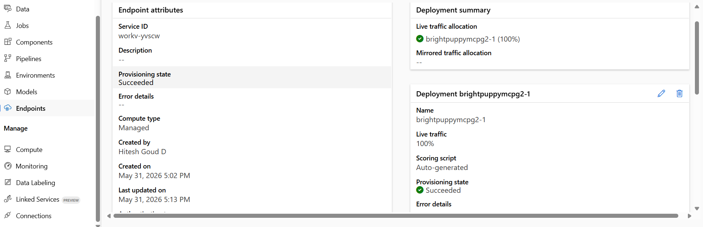

# Azure ML Model Deployment

## Project Overview
This project demonstrates the deployment of a Machine Learning model using Azure Machine Learning. The model is deployed as a Real-Time Online Endpoint (REST API) for making predictions through HTTP requests.

## Technologies Used
- Python
- Azure Machine Learning
- Google Colab
- REST API
- JSON
- Requests Library

## Features
- Trained and deployed a Machine Learning model.
- Published the model as a Real-Time Online Endpoint.
- Performed inference using Python and REST API.
- Secured endpoint access using Bearer Token authentication.

## Project Structure
```
Azure-ML-Model-Deployment/
├── ML_Deployment.ipynb
├── screenshots/
│   └── deployment_status.png
└── README.md
```

## Deployment Screenshot



## Note
API keys and endpoint URLs have been removed from the notebook for security.
